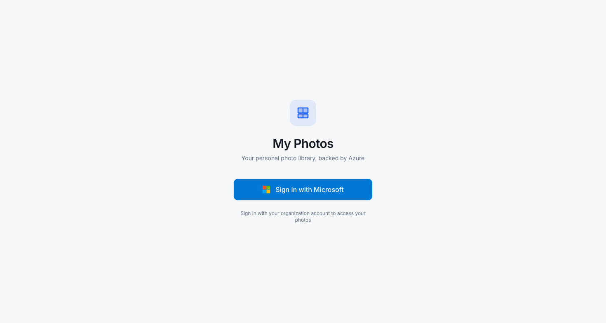
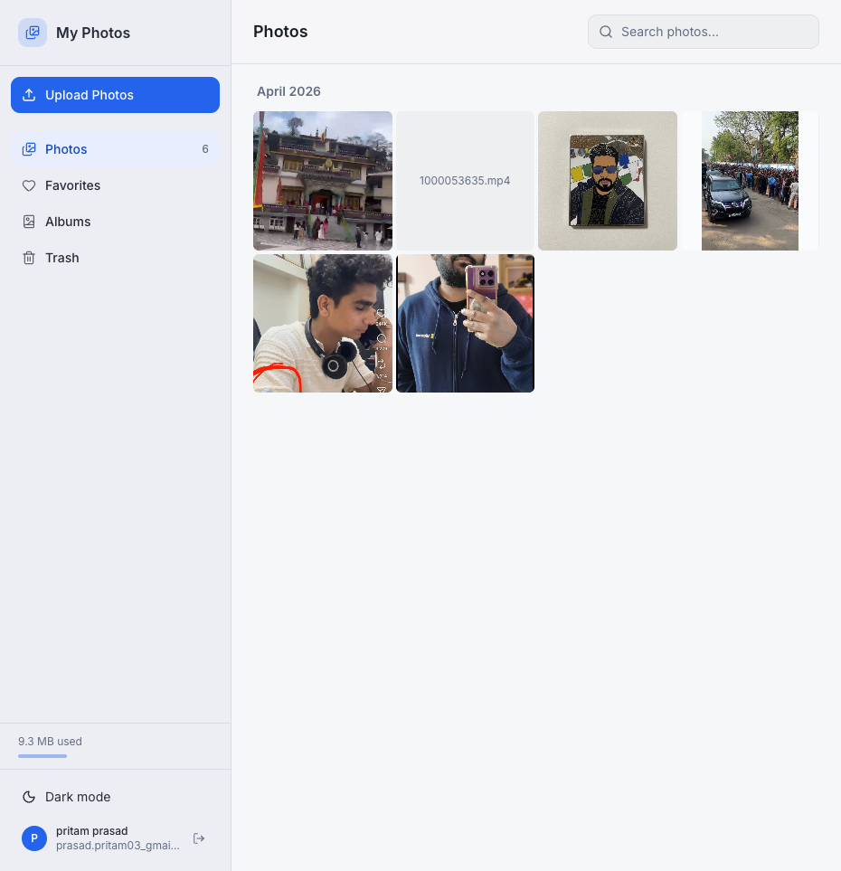
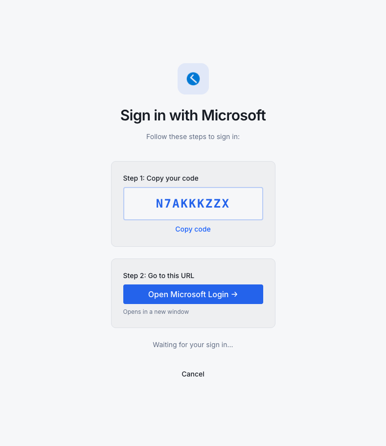
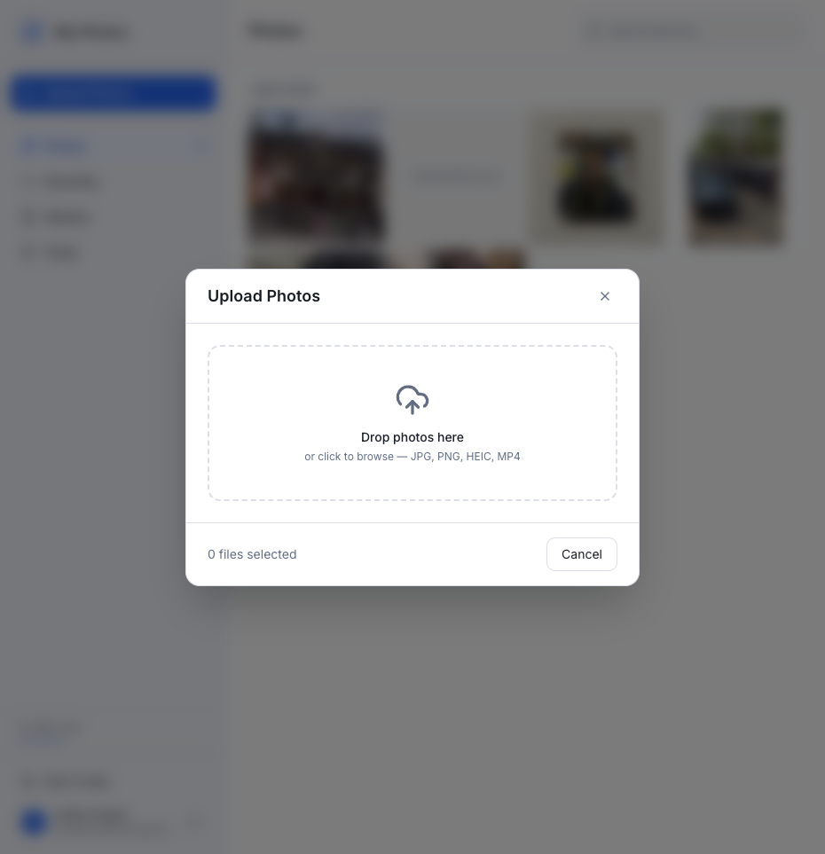
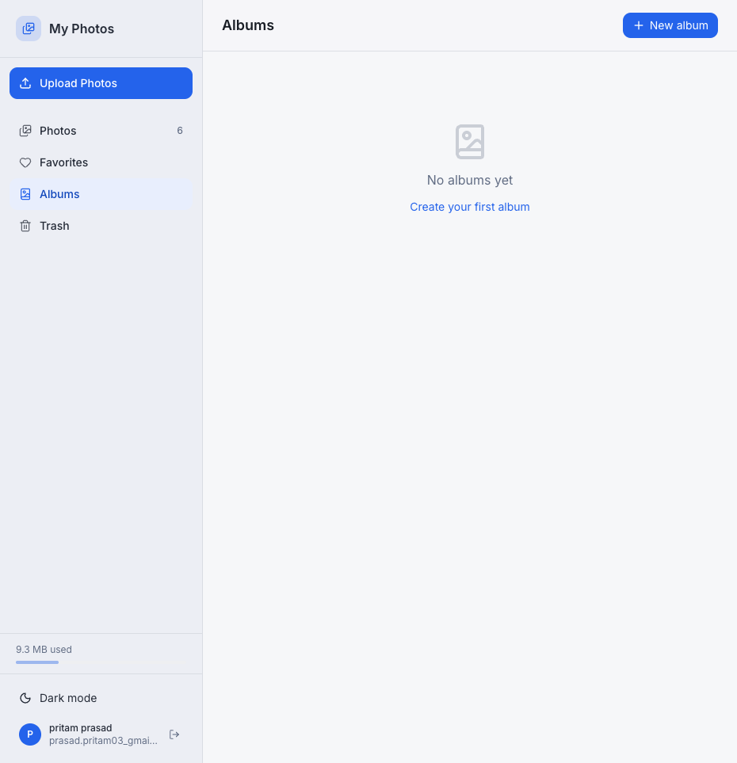

# My Photos

A Google Photos-style personal photo library — built with React, Express, Azure Blob Storage, and PostgreSQL. Sign in with any Microsoft account and your photos are stored privately in your own Azure infrastructure.

---

## What it looks like

| Login | Photo Library |
|---|---|
|  |  |

| Device Code Sign-in | Upload Photos |
|---|---|
|  |  |

| Albums |
|---|
|  |

---

## Features

- Upload photos and videos (JPG, PNG, HEIC, MP4) — drag-and-drop, file picker, or direct browser-to-storage upload
- Browse your library grouped by date with **Load More** pagination (50 photos per page)
- Search photos by filename
- Favorites — heart any photo
- Albums — create albums, upload directly to an album
- Trash — soft-delete with restore
- Archive / Hide — hide photos from the main library without deleting
- Dark mode
- Sign in with any Microsoft / Azure Entra ID account (Device Code Flow — works on any device)

---

## Prerequisites

You need:

1. A **Microsoft account** (personal @outlook.com, @hotmail.com, or work/school account)
2. An **Azure subscription** — [create a free one](https://azure.microsoft.com/free/) if you don't have one
3. The following tools installed locally:
   - [Node.js 22+](https://nodejs.org/)
   - [pnpm](https://pnpm.io/installation) — `npm install -g pnpm`
   - [Azure CLI](https://docs.microsoft.com/cli/azure/install-azure-cli) — `brew install azure-cli` on macOS
   - [GitHub CLI](https://cli.github.com/) — `brew install gh` on macOS
   - [Git](https://git-scm.com/)

---

## Step 1 — Fork & clone the repository

1. Fork this repo to your own GitHub account
2. Clone it locally:

```bash
git clone https://github.com/<YOUR_GITHUB_USERNAME>/photo-master-app.git
cd photo-master-app
pnpm install --no-frozen-lockfile
```

---

## Step 2 — Register an Azure Entra ID app

This gives users the ability to sign in with their Microsoft account.

1. Go to [portal.azure.com](https://portal.azure.com) → **Microsoft Entra ID** → **App registrations** → **New registration**
2. Fill in:
   - **Name**: `my-photos-app` (or anything you like)
   - **Supported account types**: *Accounts in any organizational directory and personal Microsoft accounts*
   - **Redirect URI**: leave blank for now
3. Click **Register**
4. On the app's overview page, copy the **Application (client) ID** — you'll need this as `MSAL_CLIENT_ID`
5. Also copy the **Directory (tenant) ID** — you'll need this as `AZURE_TENANT_ID`
6. Go to **Authentication** → scroll to **Advanced settings** → set **Allow public client flows** to **Yes** → Save

---

## Step 3 — Provision Azure resources

Log in to Azure CLI:

```bash
az login
az account set --subscription "<YOUR_SUBSCRIPTION_ID>"
```

Run these commands one by one. Replace the placeholder values shown in `< >`.

### Resource Group

```bash
az group create --name my-photos-rg --location centralindia
```

> **Region choice**: `centralindia` co-locates all resources (DB, Storage, Container App) for lowest latency. Adjust to your preferred region — just keep everything in the same region.

### Container Registry (for the API Docker image)

```bash
az acr create \
  --resource-group my-photos-rg \
  --name <UNIQUE_ACR_NAME> \
  --sku Basic \
  --admin-enabled false
# e.g. --name myphotosacr123
```

### PostgreSQL Flexible Server

```bash
az postgres flexible-server create \
  --resource-group my-photos-rg \
  --name <UNIQUE_DB_SERVER_NAME> \
  --location centralindia \
  --admin-user pgadmin \
  --admin-password "<STRONG_PASSWORD>" \
  --sku-name Standard_B1ms \
  --tier Burstable \
  --storage-size 32 \
  --version 16 \
  --database-name photo_master \
  --public-access 0.0.0.0
```

> Note the connection string for later:
> `postgresql://pgadmin:<PASSWORD>@<SERVER_NAME>.postgres.database.azure.com/photo_master?sslmode=require`

### Blob Storage

```bash
az storage account create \
  --resource-group my-photos-rg \
  --name <UNIQUE_STORAGE_NAME> \
  --location centralindia \
  --sku Standard_LRS \
  --kind StorageV2 \
  --allow-blob-public-access true

# Get the account key
STORAGE_KEY=$(az storage account keys list \
  --account-name <UNIQUE_STORAGE_NAME> \
  --resource-group my-photos-rg \
  --query "[0].value" -o tsv)

# Create the photos container with public read access (URLs are served directly)
az storage container create \
  --account-name <UNIQUE_STORAGE_NAME> \
  --account-key "$STORAGE_KEY" \
  --name photos \
  --public-access blob

# Add CORS rule so browsers can PUT files directly to storage
az storage cors add \
  --account-name <UNIQUE_STORAGE_NAME> \
  --account-key "$STORAGE_KEY" \
  --services b \
  --methods GET PUT OPTIONS HEAD \
  --origins "https://<YOUR_SWA_URL>" \
  --allowed-headers "content-type,x-ms-blob-cache-control,x-ms-blob-type,x-ms-blob-content-type" \
  --exposed-headers "ETag,Last-Modified,x-ms-request-id,x-ms-version" \
  --max-age 3600
```

### Container Apps Environment & App

```bash
az provider register --namespace Microsoft.App --wait

az containerapp env create \
  --name my-photos-env \
  --resource-group my-photos-rg \
  --location centralindia

az containerapp create \
  --name my-photos-api \
  --resource-group my-photos-rg \
  --environment my-photos-env \
  --image mcr.microsoft.com/azuredocs/containerapps-helloworld:latest \
  --target-port 3000 \
  --ingress external \
  --min-replicas 1 \
  --max-replicas 3 \
  --system-assigned
```

Note the Container App URL from the output (looks like `https://my-photos-api.<random>.centralindia.azurecontainerapps.io`).

### Static Web App (frontend)

```bash
az staticwebapp create \
  --name my-photos-frontend \
  --resource-group my-photos-rg \
  --location eastus2 \
  --sku Free
```

Note the SWA URL from the output (looks like `https://<random>.azurestaticapps.net`).

---

## Step 4 — Configure the Container App

### Set secrets

```bash
az containerapp secret set \
  --name my-photos-api \
  --resource-group my-photos-rg \
  --secrets \
    db-url="postgresql://pgadmin:<PASSWORD>@<SERVER_NAME>.postgres.database.azure.com/photo_master?sslmode=require" \
    jwt-secret="$(openssl rand -hex 32)" \
    session-secret="$(openssl rand -hex 32)"
```

### Set environment variables

> **Important**: Do not set `AZURE_CLIENT_ID`. The API uses the Container App's system-assigned managed identity automatically via `DefaultAzureCredential`. Setting `AZURE_CLIENT_ID` to any other value causes credential resolution to fail.

```bash
az containerapp update \
  --name my-photos-api \
  --resource-group my-photos-rg \
  --set-env-vars \
    NODE_ENV=production \
    PORT=3000 \
    APP_URL="https://<YOUR_SWA_URL>" \
    AZURE_STORAGE_ACCOUNT_NAME=<UNIQUE_STORAGE_NAME> \
    AZURE_STORAGE_CONTAINER_NAME=photos \
    AZURE_TENANT_ID=<YOUR_TENANT_ID> \
    MSAL_CLIENT_ID=<YOUR_APP_CLIENT_ID> \
    DATABASE_URL="secretref:db-url" \
    JWT_SECRET="secretref:jwt-secret" \
    SESSION_SECRET="secretref:session-secret"
```

---

## Step 5 — Assign managed identity to Container App

This lets the API access Blob Storage and generate SAS upload URLs without any stored keys.

```bash
# Get the identity's principal ID (--system-assigned was set at create time above)
PRINCIPAL_ID=$(az containerapp show \
  --name my-photos-api \
  --resource-group my-photos-rg \
  --query identity.principalId -o tsv)

STORAGE_ID=$(az storage account show \
  --name <UNIQUE_STORAGE_NAME> \
  --resource-group my-photos-rg \
  --query id -o tsv)

# Storage Blob Data Owner is required — Contributor is NOT sufficient.
# Owner includes the getUserDelegationKey permission needed for SAS upload URLs.
az role assignment create --assignee "$PRINCIPAL_ID" --role "Storage Blob Data Owner" --scope "$STORAGE_ID"

# Allow Container App to pull from ACR
ACR_ID=$(az acr show --name <UNIQUE_ACR_NAME> --resource-group my-photos-rg --query id -o tsv)
az role assignment create --assignee "$PRINCIPAL_ID" --role AcrPull --scope "$ACR_ID"

az containerapp registry set \
  --name my-photos-api \
  --resource-group my-photos-rg \
  --server <UNIQUE_ACR_NAME>.azurecr.io \
  --identity system
```

---

## Step 6 — Run database migrations

Allow your local IP temporarily, push the schema, then remove the rule:

```bash
MY_IP=$(curl -s https://api.ipify.org)

az postgres flexible-server firewall-rule create \
  --resource-group my-photos-rg \
  --name <DB_SERVER_NAME> \
  --rule-name allow-local \
  --start-ip-address "$MY_IP" \
  --end-ip-address "$MY_IP"

DATABASE_URL="postgresql://pgadmin:<PASSWORD>@<SERVER_NAME>.postgres.database.azure.com/photo_master?sslmode=require" \
  pnpm --filter @workspace/db run push

az postgres flexible-server firewall-rule delete \
  --resource-group my-photos-rg \
  --name <DB_SERVER_NAME> \
  --rule-name allow-local \
  --yes
```

---

## Step 7 — Set up GitHub Actions CI/CD

### Create a service principal for deployments

```bash
SP=$(az ad sp create-for-rbac \
  --name my-photos-deployer \
  --role Contributor \
  --scopes /subscriptions/<SUBSCRIPTION_ID>/resourceGroups/my-photos-rg \
  --sdk-auth)

echo "$SP"  # Copy this JSON output
```

Also give it ACR push access:

```bash
SP_CLIENT_ID=$(echo "$SP" | python3 -c "import sys,json; print(json.load(sys.stdin)['clientId'])")
ACR_ID=$(az acr show --name <UNIQUE_ACR_NAME> --resource-group my-photos-rg --query id -o tsv)
az role assignment create --assignee "$SP_CLIENT_ID" --role AcrPush --scope "$ACR_ID"
```

### Get the SWA deployment token

```bash
az staticwebapp secrets list \
  --name my-photos-frontend \
  --resource-group my-photos-rg \
  --query "properties.apiKey" -o tsv
```

### Add GitHub Secrets

Go to your GitHub repo → **Settings** → **Secrets and variables** → **Actions** → **New repository secret** and add:

| Secret name | Value |
|---|---|
| `AZURE_CREDENTIALS` | The JSON blob from `az ad sp create-for-rbac` |
| `REGISTRY_LOGIN_SERVER` | `<UNIQUE_ACR_NAME>.azurecr.io` |
| `ACR_NAME` | `<UNIQUE_ACR_NAME>` |
| `AZURE_STATIC_WEB_APPS_API_TOKEN` | SWA token from above |
| `API_URL` | `https://<YOUR_CONTAINER_APP_URL>` (used as `VITE_API_URL` at build time) |

### Push to deploy

```bash
git push origin main
```

The GitHub Actions pipeline will:
1. Build the Docker image and push it to ACR
2. Update the Container App to use the new image
3. Build the React frontend and deploy it to Static Web App

Watch progress at `https://github.com/<YOUR_USERNAME>/photo-master-app/actions`.

---

## Step 8 — Sign in and use the app

1. Open your Static Web App URL in a browser
2. Click **Sign in with Microsoft**

   

3. A device code appears — copy it, then click **Open Microsoft Login →**

   

4. Enter the code at [microsoft.com/devicelogin](https://microsoft.com/devicelogin) and sign in with your Microsoft account
5. The app automatically detects the completed sign-in and takes you to your library

   

6. Click **Upload Photos** to add your first photos — drag-and-drop or click to browse

   

---

## Architecture

```
Browser (React SPA)
      │
      │  HTTPS
      ▼
Azure Static Web App          ← frontend (HTML/JS/CSS)
      │
      │  /api/* (cross-origin fetch with credentials)
      ▼
Azure Container App           ← Express API (Node 22, Docker) — Central India
  ├── /api/auth/*             ← Device Code Flow + JWT HttpOnly cookie
  ├── /api/photos/*           ← presign · register · list (paginated) · search · favorite · trash · hide
  ├── /api/albums/*           ← create · list · add photos
  └── /api/blobs/*            ← local-dev blob proxy
      │                 │
      ▼                 ▼
Azure Blob Storage    Azure PostgreSQL    Azure Entra ID
(Central India)       (Central India)    (Device Code + JWT)
public-read container  photo_master DB
```

**Auth flow:**
1. Frontend calls `/api/auth/login` → API requests a device code from Microsoft Entra ID
2. User visits [microsoft.com/devicelogin](https://microsoft.com/devicelogin) and enters the code
3. API polls Microsoft and receives an access token → creates a JWT → sets `HttpOnly; SameSite=None; Secure` cookie
4. All subsequent API calls carry the cookie automatically

**Upload flow (direct browser → storage):**
1. Frontend calls `POST /api/photos/presign` with filename + content type
2. API generates a user-delegation SAS URL (signed by the managed identity's `Storage Blob Data Owner` role)
3. Browser PUTs the file directly to Blob Storage using the SAS URL (no bytes go through the API)
4. Frontend calls `POST /api/photos/register` with the blob name to save metadata in PostgreSQL

**Blob serving:**
- Photos container has public-read access — URLs are direct `https://<account>.blob.core.windows.net/photos/<blob>` with no expiry
- CORS is configured on the storage account to allow PUT from the frontend origin

---

## Local development

```bash
# 1. Copy and fill in the env file
cp artifacts/api-server/.env.example artifacts/api-server/.env
# Fill in DATABASE_URL, MSAL_CLIENT_ID, AZURE_TENANT_ID,
# AZURE_STORAGE_ACCOUNT_NAME, AZURE_STORAGE_CONTAINER_NAME

# 2. Start the API
cd artifacts/api-server
pnpm build
node --env-file=.env dist/index.mjs

# 3. In another terminal, start the frontend (proxies /api to localhost:3000)
cd artifacts/my-photos
pnpm dev
# Open http://localhost:5173
```

> For blob storage in local dev, run `az login` first — `DefaultAzureCredential` will use your local Azure CLI session.

---

## Tech stack

| Layer | Technology |
|---|---|
| Frontend | React 18, Vite 7, TanStack Query, Wouter, Tailwind CSS 4 |
| API | Express 5, Node.js 22, TypeScript |
| Auth | Azure Entra ID — Device Code Flow, JWT HttpOnly cookies |
| Database | PostgreSQL 16 (Azure Flexible Server), Drizzle ORM |
| Storage | Azure Blob Storage, DefaultAzureCredential (keyless) |
| Hosting | Azure Static Web Apps (frontend) + Azure Container Apps (API) |
| CI/CD | GitHub Actions |
| Monorepo | pnpm workspaces |
